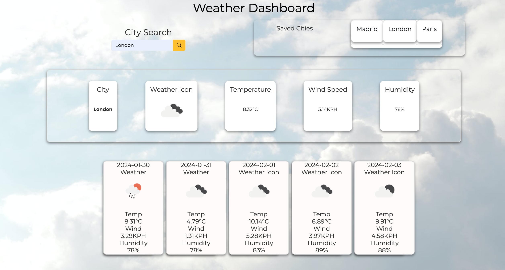

# Weather-Dashboard

## Description

This Weather application allows users to efficiently view their desired city. The application provides a user a friendly interface enabling a user to search for a city and the city will be added in the "Saved Cities" section. A User will be able to see the current Weather and the next 5 days.

## Challenge / Solution

While developing this application. I encountered a challenge when retrieving data from the 5 day OpenWeather API as the principle was slightly different when retrieving data for current weather. In addition finding how to display the weather Icon was another area that took long scrolling though the documentation.The solution was understanding OpenWeather Documentation and the helps of Stack Overflow to find insight to fix the issues.

## Installation

1.  Clone the repository to your local machine using:
    git clone https://github.com/SKhail/Weather-Dashboard.git
    cd Weather-Dashboard
2.  Once cloned, you can start the application
3.  You will have it in your local machines and can start the Application.

## Usage

1.  Clone the repository to your local machine using:
    git clone https://github.com/SKhail/Weather-Dashboard.git
    cd Weather-Dashboard
2.  Once cloned, you can start the application
3.  Access the deployed application [Deployed Site Link] (https://skhail.github.io/Daily-Planner-App/)
4.  You will have it in your local machines and can start the Application.
5.  Refer to the screenshot below to see the application

>

## Feature

Added a alert component when a user does not enter anything in the search field

## Credits

N/A

## License

This project is licened under the MIT License.

## Resources

[https://icons.getbootstrap.com/]
[https://getbootstrap.com/docs/5.3/components/card/]
[https://openweathermap.org/forecast5#geocoding]
[https://www.pexels.com/]
